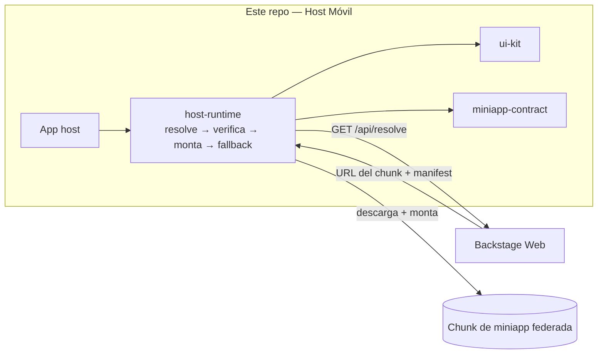

# Backstage React Native — Host Móvil

> App host en **React Native + Re.Pack** que migra una app bancaria legada de Android a una arquitectura moderna de **micro-frontends**: carga **miniapps** construidas de forma independiente, bajo demanda, vía **Module Federation** — sin recompilar el host para publicar la actualización de una miniapp.

**🔗 Demo de la plataforma en vivo:** **[backstage-web-blond.vercel.app](https://backstage-web-blond.vercel.app)**
**🌐 English:** [README.md](./README.md)

---

## La idea

Una super-app bancaria donde las funciones (cuentas, tarjetas, transferencias…) son **miniapps** — cada una con su repo, su CI y su cadencia de release — y el host las descarga y monta en runtime. El plano de control web que las crea y distribuye es **[Backstage Web](https://github.com/DentVega/backstage-web)**; este repo es el **host móvil** que las consume.



## Estructura del monorepo

```
apps/
  host/                     Host React Native (Re.Pack / Module Federation v2)
packages/
  miniapp-contract/         Contrato de tipos compartido: manifest, forma del resolve, capabilities, version-skew
  host-runtime/             Loader: resolve → chequeo de integridad → monta remote → fallback; sesión + capabilities acotadas
  ui-kit/                   Primitivas del design-system compartidas (StyleSheet + tokens)
memory-bank/                Artefactos del proceso AI-DLC (ver abajo)
```

## Qué lo hace interesante

- 🧩 **Module Federation en React Native** vía **Re.Pack** (Rspack) — no Metro. Host + chunks remotos bajo demanda, singletons compartidos (React, RN, React Query).
- 🔐 **Frontera de seguridad** — la auth/sesión vive solo en el host; las miniapps reciben **capabilities acotadas y revocables**, nunca credenciales crudas. La integridad del chunk se verifica antes de montar.
- 📜 **Contrato versionado** — el host y Backstage comparten exactamente una cosa: `@org/miniapp-contract`. El host resuelve miniapps por **rango semver**, así controla su propia ventana de compatibilidad.
- 🤖 **Flujo AI-DLC** — todo el proyecto se construyó con un ciclo de entrega asistido por IA (Inception → bolts de Construcción → Operations), con cada decisión trazada en `memory-bank/` (requisitos, ADRs, registros de bolt). Es un showcase de *cómo* se dirigió el trabajo, no solo del resultado.

## Stack

**React Native 0.76** (New Architecture) · **Re.Pack 5** (Rspack + Module Federation v2) · **TypeScript** (strict) · **FlashList** · navegadores nativos · workspaces **pnpm**.

## El `memory-bank/` — el proceso como diferenciador

Este repo lleva un rastro **AI-DLC** completo: intents de negocio → units → stories → **bolts** (cada uno recorrido por Model → Design → ADR → Implement → Test con checkpoints humanos). Explora `memory-bank/intents/` y `memory-bank/bolts/` para ver requisitos, ADRs y resultados de cada feature construida.

## Estado

La **demo de la plataforma web está en vivo** (link arriba). La capa JS/federación del host móvil está construida y testeada; el build nativo completo en dispositivo está bloqueado por el entorno de la máquina actual y queda fuera del alcance de este showcase — la historia de valor es la **arquitectura de federación + el flujo de entrega**.

## Repos relacionados

| Repo | Rol |
|---|---|
| [backstage-web](https://github.com/DentVega/backstage-web) | **Plano de control web** — registro, scaffolder, auth, estado de CI *(demo en vivo)* |
| [miniapp-template](https://github.com/DentVega/miniapp-template) | Plantilla GitHub desde la que se scaffoldean nuevas miniapps |
| [miniapp-account-dashboard](https://github.com/DentVega/miniapp-account-dashboard) | Miniapp de ejemplo (remote federado) |

---

<sub>Proyecto demo/portfolio. Demuestra micro-frontends para React Native vía Re.Pack Module Federation y un flujo de entrega asistido por IA. No es un producto bancario de producción.</sub>
