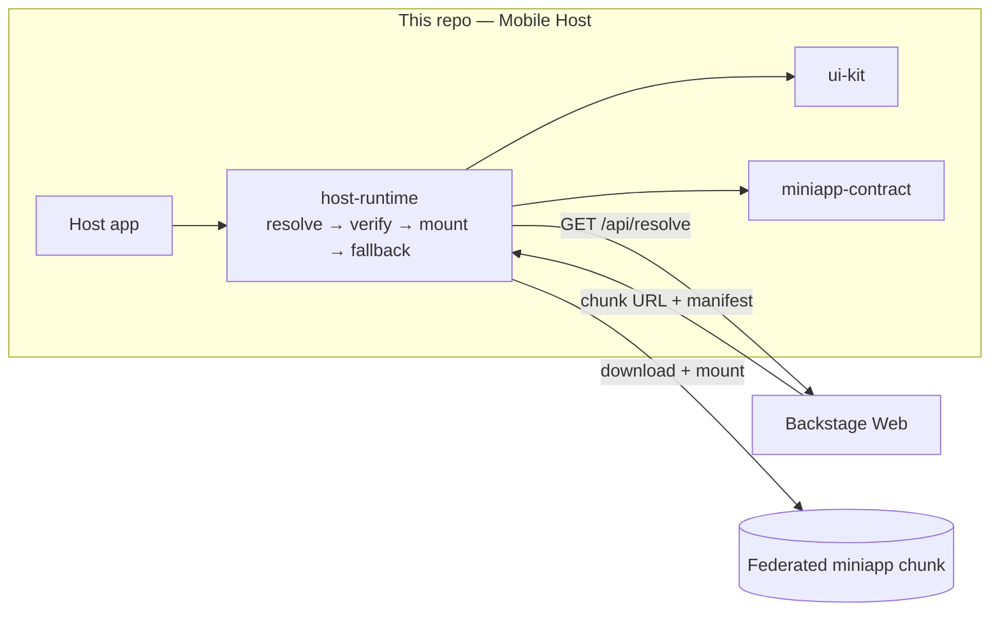

# Backstage React Native — Mobile Host

> A **React Native + Re.Pack** host app that migrates a legacy Android banking app to a modern **micro-frontend** architecture: it loads independently built **miniapps** on demand via **Module Federation** — no host rebuild to ship a miniapp update.

**🔗 Live platform demo:** **[backstage-web-blond.vercel.app](https://backstage-web-blond.vercel.app)**
**🌐 Español:** [README.es.md](./README.es.md)

---

## The idea

A banking super-app where features (accounts, cards, transfers…) are **miniapps** — each its own repo, its own CI, its own release cadence — and the host downloads and mounts them at runtime. The web control plane that creates and distributes them is **[Backstage Web](https://github.com/DentVega/backstage-web)**; this repo is the **mobile host** that consumes them.



## Monorepo layout

```
apps/
  host/                     React Native host (Re.Pack / Module Federation v2)
packages/
  miniapp-contract/         Shared type contract: manifest, resolve shape, capabilities, version-skew logic
  host-runtime/             Loader: resolve → integrity check → mount remote → fallback; session + scoped capabilities
  ui-kit/                   Shared design-system primitives (StyleSheet + tokens)
memory-bank/                AI-DLC process artifacts (see below)
```

## What makes it interesting

- 🧩 **Module Federation on React Native** via **Re.Pack** (Rspack) — not Metro. Host + on-demand remote chunks, shared singletons (React, RN, React Query).
- 🔐 **Security boundary** — auth/session lives in the host only; miniapps receive **scoped, revocable capabilities**, never raw credentials. Chunk integrity is verified before mount.
- 📜 **Versioned contract** — the host and Backstage share exactly one thing: `@org/miniapp-contract`. The host resolves miniapps by **semver range**, so it controls its own compatibility window.
- 🤖 **AI-DLC workflow** — the whole project was built through an AI-assisted delivery lifecycle (Inception → Construction bolts → Operations), with every decision traced in `memory-bank/` (requirements, ADRs, bolt records). It's a showcase of *how* the work was driven, not just the result.

## Tech stack

**React Native 0.76** (New Architecture) · **Re.Pack 5** (Rspack + Module Federation v2) · **TypeScript** (strict) · **FlashList** · native navigators · **pnpm** workspaces.

## The `memory-bank/` — process as a differentiator

This repo carries a full **AI-DLC** trail: business intents → units → stories → **bolts** (each walked through Model → Design → ADR → Implement → Test with human checkpoints). Browse `memory-bank/intents/` and `memory-bank/bolts/` to see requirements, architecture decision records, and outcomes for every feature that was built.

## Status

The **web platform demo is live** (link above). The mobile host's JS/federation layer is built and unit-tested; a full on-device native build is environment-blocked on the current machine and is out of scope for this showcase — the value story is the **federation architecture + delivery workflow**.

## Related repos

| Repo | Role |
|---|---|
| [backstage-web](https://github.com/DentVega/backstage-web) | **Web control plane** — registry, scaffolder, auth, CI status *(live demo)* |
| [miniapp-template](https://github.com/DentVega/miniapp-template) | GitHub template new miniapps are scaffolded from |
| [miniapp-account-dashboard](https://github.com/DentVega/miniapp-account-dashboard) | Example miniapp (federated remote) |

---

<sub>Portfolio/demo project. Demonstrates micro-frontends for React Native via Re.Pack Module Federation and an AI-assisted delivery workflow. Not a production banking product.</sub>
